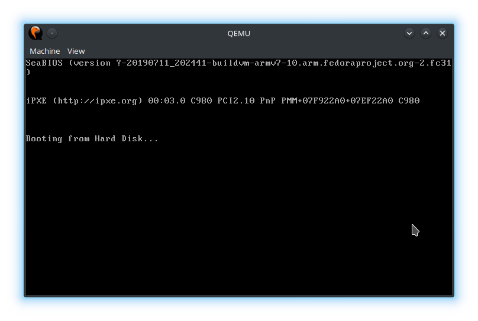

Following the tutorial from Daedalus Community. [link](https://www.youtube.com/watch?v=MwPjvJ9ulSc)

The following are my notes

## Part 1: Bootloader

Pre-requisites - nasm, qemu - installed via package manager.

* Code file: `boot.asm`
* bootloader is exactly 512 bytes long
* Ends with hexadecimal values `55 aa`
* `$` is current memory address
* `times` - repeats an action - something like a pre-processor macro
* it pads out the length of the file to reach the required size
* `db` is define byte
* `$$` - address of current section
* Command: `nasm -f bin boot.asm -o boot.bin` 

### Command: `nasm`

* `nasm` - the assembler
* `-f bin` - set format to bin
* `boot.asm` - input file to assemble
* `-o boot.bin` - output file
* This will create a boot.bin file

### Booting the file

* Command: `qemu-system-x86-64 boot.bin`
* This will start the virtual machine and show "Booting from Hard Disk..."
  which means it was successful. 
* Changing the length or the file will result in the emulator not being able to
  boot
* Screenshot: 
